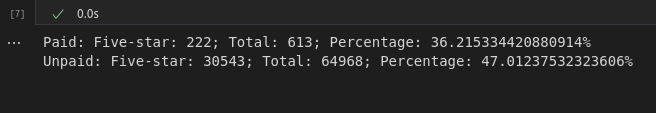

# Amazon_Vine_Analysis
## Overview of the analysis
This project is to analyze Amazon Vine program and determine if there is any bias toward favorable reviews from Vine members in the dataset. The anaysis utilizes PySpark to perform the ETL process to extract the dataset, transform the data, connect to an AWS RDS instance, and load the transformed data into pgAdmin. Then, it utilizes Pandas to determine Bias of Vine Reviews. 

## Results 
How many Vine reviews and non-Vine reviews were there? 
There were 613 vine reviews and 64968 non-Vine reviews there.

How many Vine reviews were 5 stars? How many non-Vine reviews were 5 stars?
Vine Review: there were 222 5 stars.
Non-vine Review: there were 30543 5 stars.

What percentage of Vine reviews were 5 stars? What percentage of non-Vine reviews were 5 stars?
Vine Review 5 stars: 36% 
Non-vine Review 5 stars: 47% 

## Summary 
The percentage of Vine reviews that were 5 stars is 36%, while the percentage of non-Vine reviews that were 5 stars is only 47%. There is no positive bias for reviews in the Vine program. 

Additional analysis: We could analyze dataset to see how many Vine reviews or Non-vine reviews were 1 star and the corresponding percentages to further support the statement. 

